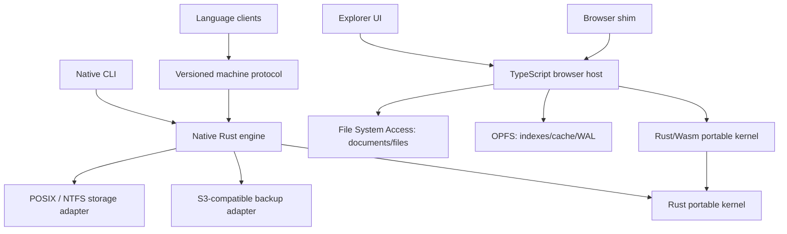

# FYLO Rust Engine Project Plan

- Status: **accepted for incremental implementation**
- Plan date: **2026-07-26**
- Accepted: **2026-07-26**
- Migration style: **incremental replacement, not a big-bang rewrite**
- Product versioning: **existing CalVer policy remains authoritative**

## 1. Executive decision

Build FYLO's next engine generation in Rust, while preserving the existing
JavaScript implementation as the compatibility oracle until the Rust engine
earns promotion.

The target product has two Rust deliverables:

1. a full native engine and CLI for authoritative local-filesystem operation;
2. a portable kernel compiled to WebAssembly for browser query, index, codec,
   and deterministic state-transition work.

The browser shim and Explorer remain TypeScript/JavaScript hosts. They own
browser APIs, worker lifecycle, File System Access handles, OPFS persistence,
and UI integration. WebAssembly does not pretend to provide POSIX, NTFS, or
browser filesystem semantics. Rust's `wasm32-unknown-unknown` target supports
the standard library only partially, and filesystem functions do not become
browser storage APIs merely because native code compiles to Wasm.

This plan does **not** authorize:

- a new on-disk format;
- two processes writing the same FYLO root;
- replacing the current production engine before compatibility gates pass;
- treating S3-compatible storage as the primary data store;
- rewriting the Explorer or marketing website in Rust;
- publishing Rust crates as stable public APIs before an explicit RFC;
- claiming that cross-compilation proves platform support.

FYLO remains local-filesystem primary. S3-compatible storage remains an
additive backup, verify, and restore boundary. Documents remain authoritative;
indexes and caches remain rebuildable derived state.

## 2. What was learned from the local SESAME project

The local SESAME repository was audited at commit
`bab46adfb6c612db63ec4b1ea2ba2c36407ce9e7` (`Initial SESAME implementation`).
Its entire initial foundation landed in one commit, so the repository history
does not reveal a sequential bootstrap. The intended creation sequence is
instead recorded in `docs/PROJECT_PLAN.md`, its ADRs, conformance documents,
tests, and workflows.

### 2.1 Practices to adopt

SESAME establishes several useful standards:

- “Supported” is an evidence label, not a synonym for “implemented.”
- Domain language, trust boundaries, invariants, and non-goals are written down
  before extension points proliferate.
- The engine is headless; clients are thin subprocess/protocol shims.
- Canonical machine contracts live under `api/`, with schemas, fixtures, and
  golden decisions.
- Package-local tests are kept beside the code; black-box, adversarial,
  interoperability, and qualification tests have explicit top-level homes.
- ADRs record hard-to-reverse decisions; RFCs define proposed public behavior.
- Governance, security reporting, support, contribution, and release policies
  exist at the repository root.
- CI executes one contract corpus through real compiled binaries in every
  supported client language.
- Coverage floors are ratchets for meaningful package groups, not one vanity
  percentage.
- Release artifacts carry checksums, SBOMs, build provenance, and runtime
  identity.
- Release documentation distinguishes buildable, native-tested, preview, and
  supported.
- A release-evidence runner records exact artifact identities, platform,
  filesystem, limits, restore results, compatibility results, and soak
  measurements in a machine-readable report.
- Empty folders and generic `utils`, `common`, `misc`, or `manager` dumping
  grounds are prohibited.

### 2.2 Practices to strengthen for FYLO

FYLO should improve on the SESAME bootstrap in these areas:

- Land small, reversible, vertically complete pull requests instead of one
  enormous initial commit.
- Build release executables on their native operating systems and
  architectures, then test and publish those exact bytes. SESAME's current
  release workflow cross-compiles from Linux and correctly documents that this
  proves buildability only.
- Create a draft release, download and verify every staged asset, run
  installer/upgrade smoke tests, and only then publish.
- Make storage-format compatibility and crash recovery first-class release
  evidence; these are deeper concerns for FYLO than for a consumer of FYLO.
- Maintain an explicit `unsafe` inventory and review gate for platform code.
- Add filesystem-specific corruption, power-loss, symlink/reparse-point,
  metadata, and durability matrices.
- Keep benchmark results in retained CI evidence rather than committing
  generated benchmark output or target directories.

### 2.3 Definition of an enterprise-supported feature

A feature is supported only when all applicable rows exist:

| Evidence            | Required proof                                                                      |
| ------------------- | ----------------------------------------------------------------------------------- |
| Implementation      | Production path exists behind a documented contract                                 |
| Unit/model proof    | Invariants and state transitions pass deterministic tests                           |
| Negative proof      | Malformed, denied, exhausted, stale, and concurrent paths pass                      |
| Native proof        | Tests pass on every claimed OS, architecture, and filesystem                        |
| Crash proof         | Failure around each durable boundary produces a valid recoverable state             |
| Compatibility proof | Old data and clients work within the published compatibility window                 |
| Operations proof    | Backup, restore, repair, upgrade, and rollback behavior is documented and tested    |
| Security proof      | Threat-model controls and dependency policy pass                                    |
| Performance proof   | Published limits pass on named reference environments                               |
| Documentation       | User, operator, protocol, and limitation documentation is current                   |
| Release proof       | Exact distributed bytes pass identity, checksum, provenance, and smoke verification |

Missing evidence changes the label to **experimental**, **preview**, or
**unsupported**. It must not be hidden by a broad “cross-platform” claim.

## 3. Non-negotiable FYLO invariants

The rewrite must preserve these rules unless a separately accepted ADR and
migration RFC replace one:

1. One document or raw file is the smallest authoritative storage unit.
2. Documents are the source of truth. Indexes contain no document payload and
   can be rebuilt from documents.
3. TTIDs remain opaque, time-ordered primary identifiers.
4. One process owns one root for writes. Aliases, symlinks, junctions, and
   canonical-path variations must not create two owners.
5. A successful write is acknowledged only after its documented durability
   boundary.
6. Recovery is idempotent. Repeating recovery cannot make a valid state worse.
7. Queries must return the same rows, ordering, pagination, and stable errors
   as the compatibility contract specifies.
8. Canonical metadata includes native metadata such as creation/update/mtime
   where supported, plus custom metadata, without silently losing either.
9. UID, GID, and mode enforcement remains explicit and platform-aware. Windows
   behavior is not described as POSIX ownership.
10. Encryption never falls back to ciphertext-as-plaintext or plaintext after
    a key/decryption failure.
11. S3-compatible backup is not authoritative state and cannot weaken local
    durability.
12. The machine protocol remains bounded NDJSON with stable error codes.
13. Browser storage is local browser state. FSA is the document/file boundary;
    OPFS is suitable for private index, cache, and WAL state.
14. A browser or native fallback may be slower, but it may not be semantically
    weaker.
15. No migration test may run two writers against the same root. Differential
    write tests use cloned roots or replay the same operation log into separate
    roots.

## 4. Architecture

### 4.1 Product boundary



The native engine and browser host share deterministic algorithms and formats,
not operating-system adapters. The browser does not spawn the native binary,
and the native binary does not embed a web UI.

### 4.2 Dependency direction

Dependency direction is inward:

```text
format <- query <- engine <- machine <- cli
                 ^       ^
                 |       |
          storage-native replication-s3

format <- query <- wasm
```

Rules:

- `fylo-format` and `fylo-query` contain no filesystem, process, network, or UI
  dependencies.
- `fylo-engine` owns use-case interfaces and deterministic state transitions.
- Adapters implement interfaces owned by the consuming engine boundary.
- Only composition roots choose concrete adapters.
- The CLI is not imported by any library crate.
- Wasm never depends on `fylo-storage-native`.
- S3 code never becomes a hidden source of truth.
- Client shims do not reimplement query, permissions, retry, or transaction
  semantics.
- Crate boundaries are introduced only with working behavior and tests.

### 4.3 Initial Cargo workspace

Use one virtual Cargo workspace and one lockfile. Cargo workspaces provide
shared commands, lockfile, output directory, package metadata, dependency
versions, profiles, and lint policy.

Start with the following crates:

| Crate                 | Responsibility                                                                    | Public status      |
| --------------------- | --------------------------------------------------------------------------------- | ------------------ |
| `fylo-format`         | Canonical disk/wire types, codecs, version headers, checksums, metadata envelopes | Internal           |
| `fylo-query`          | Parser, planner, predicates, prefix/range/index algorithms                        | Internal           |
| `fylo-engine`         | Collections, schemas, permissions, transaction state machine, recovery decisions  | Internal           |
| `fylo-storage-native` | Native files, locking, atomic replace, sync, xattr/ADS, POSIX/Windows security    | Internal           |
| `fylo-replication-s3` | Backup manifest, upload, verify, restore, provider compatibility                  | Internal           |
| `fylo-machine`        | NDJSON request/response contract, limits, cancellation, stable errors             | Internal           |
| `fylo-cli`            | Native executable and dependency composition                                      | Distributed binary |
| `fylo-wasm`           | Narrow Wasm ABI over portable format/query/index functions                        | Distributed Wasm   |
| `fylo-testkit`        | Golden roots, model runner, failpoints, corruption tools                          | `publish = false`  |

Do not split more crates until compilation ownership, security review, target
features, or independent release requirements justify the boundary.

### 4.4 Proposed repository structure

The existing JavaScript tree remains in place during migration.

```text
/
├── Cargo.toml
├── Cargo.lock
├── rust-toolchain.toml
├── rustfmt.toml
├── deny.toml
├── VERSION
├── api/
│   ├── machine/v1/
│   │   ├── README.md
│   │   ├── schema.json
│   │   ├── operations.json
│   │   └── fixtures.ndjson
│   ├── storage/v1/
│   │   ├── README.md
│   │   ├── manifest.schema.json
│   │   └── golden/
│   ├── backup/v2/
│   │   ├── README.md
│   │   └── manifest.schema.json
│   └── errors/
│       └── v1.json
├── crates/
│   ├── fylo-format/
│   ├── fylo-query/
│   ├── fylo-engine/
│   ├── fylo-storage-native/
│   ├── fylo-replication-s3/
│   ├── fylo-machine/
│   ├── fylo-cli/
│   ├── fylo-wasm/
│   └── fylo-testkit/
├── fuzz/
│   ├── fuzz_targets/
│   ├── corpus/
│   └── Cargo.toml
├── tests/
│   ├── contract/
│   ├── differential/
│   ├── golden/
│   ├── crash/
│   ├── corruption/
│   ├── recovery/
│   ├── migration/
│   ├── native/
│   ├── interop/
│   ├── browser/
│   ├── s3/
│   ├── performance/
│   └── fixtures/
├── benches/
│   ├── engine/
│   ├── query/
│   └── format/
├── xtask/
│   └── src/
├── clients/
├── explorer/
├── website/
├── src/                         # Current JS engine during migration
├── docs/
│   ├── adr/
│   ├── rfcs/
│   ├── architecture/
│   ├── reference/
│   ├── development/
│   ├── compatibility/
│   ├── operations/
│   ├── security/
│   ├── performance/
│   └── releases/
├── tools/
├── scripts/                     # Existing JS build/release scripts
└── .github/
    ├── CODEOWNERS
    ├── dependabot.yml
    └── workflows/
```

`xtask` owns repository-specific orchestration that is safer and more portable
in Rust than duplicated Bash and PowerShell. It may generate fixtures, inspect
artifacts, run release qualification, and validate manifests. It must not hide
ordinary Cargo commands or become a generic task dumping ground.

Generated benchmark outputs, `target/`, fuzz artifacts, coverage, temporary
roots, and soak evidence are ignored locally and uploaded as retained CI
artifacts.

## 5. Rust engineering policy

### 5.1 Toolchain

- Keep the full compiler version pinned in `rust-toolchain.toml`.
- Initially retain the repository's existing `1.97.1` pin.
- Add `rustfmt` and `clippy` components explicitly.
- Update the compiler through reviewed dependency/toolchain pull requests.
- Record `rustc -Vv`, Cargo version, target, profile, enabled features, commit,
  and lockfile digest in every release manifest.
- FYLO binaries support the shipped artifacts, not arbitrary local compiler
  versions.
- If crates are later published, each declares `rust-version` and CI verifies
  the stated MSRV. No MSRV is implied before then.
- Nightly is allowed only for isolated qualification jobs such as Miri,
  sanitizer, or fuzz work. Production release builds use the pinned stable
  compiler.

### 5.2 Language and API rules

- Use Rust 2024 edition and workspace resolver 3 unless an accepted ADR records
  a compiler or dependency conflict.
- Workspace lints are inherited by every crate.
- `unsafe_code = "forbid"` is the default.
- Only narrowly scoped native platform modules may override that rule.
- Every unsafe block requires a `SAFETY:` invariant, a named owner, focused
  tests, and an entry in `docs/security/unsafe-inventory.md`.
- Panics are bugs at public, file, protocol, query, and recovery boundaries.
- Use typed errors internally and stable public error codes externally.
- Human error messages are not parsing contracts.
- Bound file sizes, frame sizes, recursion, allocation, result counts,
  concurrency, retries, backoff, and external reads.
- Inject clock, ID generation, randomness where non-cryptographic
  determinism is needed. Production cryptographic randomness cannot be
  caller-substituted.
- Avoid mutable globals and implicit process-wide configuration.
- Default features are minimal. Platform and provider features are explicit.
- Public serialization uses explicit field names and rejects or preserves
  unknown fields according to the versioned contract.

### 5.3 Dependency policy

- Prefer the standard library for small, security-sensitive primitives.
- Every direct dependency needs an owner, purpose, feature list, license, and
  replacement/exit assessment in the pull request.
- Disable dependency default features unless all are intentionally required.
- `Cargo.lock` is committed and release builds use `--locked --frozen`.
- Git dependencies are prohibited in release branches unless pinned to an
  immutable revision by an accepted exception.
- Unknown registries and unapproved sources fail CI.
- Duplicate versions are reviewed, not blindly forbidden.
- Advisory exceptions require an expiry date, reachability assessment, and
  tracking issue.
- `cargo-deny` enforces advisories, licenses, banned crates, duplicate review,
  and sources.
- Released native binaries embed auditable dependency metadata.

## 6. Canonical contracts

The rewrite begins by extracting contracts from behavior that already ships.
The contract is not inferred from Rust types.

### 6.1 Storage contract

Define and freeze:

- root and collection discovery;
- document and raw-file paths;
- canonical encoding;
- TTID validation and ordering;
- schemas and schema version transitions;
- custom and canonical metadata;
- xattr/alternate-data-stream behavior;
- UID, GID, and mode behavior;
- encryption envelopes and key failure behavior;
- tombstone, recovery, and version-history behavior;
- index snapshot and WAL formats;
- transaction journal phases and durable markers;
- backup manifest versions and platform tags;
- corruption and unsupported-version errors.

Every binary format gets:

- an explicit magic/version header where feasible;
- bounded lengths before allocation;
- canonical byte rules;
- checksums at corruption boundaries;
- golden fixtures created by released JavaScript binaries;
- malformed and truncated fixture sets;
- forward/unknown-version behavior;
- upgrade and rollback policy.

### 6.2 Machine contract

Move the canonical machine contract under `api/machine/v1`:

- JSON Schema for requests, responses, errors, and version identity;
- operation registry with idempotency and retry safety;
- maximum frame and field sizes;
- cancellation and timeout behavior;
- stdout/stderr ownership;
- stable errors with `code`, safe `message`, `retryable`, and bounded
  `details`;
- protocol compatibility negotiation;
- deterministic fixtures executed by every client language.

The existing client shims remain thin. A compatible Rust engine should require
no client rewrite beyond version-range metadata.

### 6.3 Wasm ABI

The Wasm ABI is intentionally narrow and versioned:

- load or replace an index snapshot;
- apply bounded WAL additions/removals;
- execute query plans;
- encode/decode canonical index records;
- return owned result buffers and stable errors;
- expose ABI/build/format versions;
- cleanly free all allocated buffers.

The TypeScript host owns:

- worker startup/restart;
- feature detection;
- FSA permission prompts and handle recovery;
- OPFS reads, writes, compaction, and atomic replacement;
- JS/Wasm buffer transfer;
- fallback selection;
- cancellation and resource budgets.

The JavaScript fallback must run the same golden and differential corpus.

## 7. Migration roadmap

Dates are deliberately omitted. A storage-engine phase closes when its evidence
passes, not when a calendar milestone arrives.

### Phase 0 — Decision and repository foundation

Deliver:

- accept this plan;
- ADR 0001: Rust native engine and portable Wasm kernel;
- ADR 0002: compatibility-first strangler migration;
- ADR 0003: native versus browser storage boundaries;
- ADR 0004: unsafe and dependency policy;
- root Cargo workspace, lockfile, lints, formatting, deny policy, and `xtask`;
- `VERSION`, governance documents, ownership, and support vocabulary;
- empty-crate prohibition enforced by review.

Exit gate:

- clean checkout runs formatting, linting, unit tests, documentation tests, and
  dependency policy on Linux, macOS, and Windows;
- adding the workspace changes no FYLO production behavior or release bytes.

Rollback:

- remove the workspace-only commit; the existing engine is unaffected.

### Phase 1 — Compatibility oracle and golden corpus

Deliver:

- black-box operation recorder for the current JavaScript engine;
- versioned roots covering documents, files, indexes, schemas, metadata,
  permissions, encryption, versions, tombstones, and interrupted transactions;
- query and error golden corpus;
- machine protocol fixtures;
- root copier that preserves required metadata;
- differential result normalizer that does not erase meaningful platform
  differences.

Exit gate:

- released JavaScript binaries reproduce the fixture corpus;
- every fixture records producer version, platform, filesystem, digest, and
  expected support tier;
- corruption cases prove the current expected error, not merely “did not
  crash.”

Rollback:

- fixtures and harness are additive and may remain even if Rust work stops.

### Phase 2 — Portable format and query kernel

Deliver:

- `fylo-format`;
- `fylo-query`;
- Rust readers for existing document/index/query representations;
- deterministic query parser/planner and prefix/range/intersection algorithms;
- property tests and fuzz targets;
- byte/result differential tests against JavaScript.

Exit gate:

- all supported fixtures parse or reject with the expected stable error;
- byte-for-byte output parity exists wherever bytes are canonical;
- query rows, ordering, pagination, and errors match;
- Miri passes portable crates;
- no filesystem or network dependency enters the portable kernel.

Rollback:

- no production path uses Rust yet.

### Phase 3 — Browser Wasm integration

Build on the existing PoC, which showed only a small codec-only gain but a
roughly 3–5x warm scan gain on representative larger snapshots.

Deliver:

- production `fylo-wasm` ABI behind the existing dedicated-worker contract;
- OPFS snapshot loading with I/O and compute measured separately;
- incremental WAL additions/removals;
- reverse, exact, prefix, numeric-range, and intersection parity;
- restart, compaction, invalidation, and memory-pressure behavior;
- JavaScript fallback with observable reason codes;
- Content Security Policy and MIME guidance for self-hosters.

Exit gate:

- full browser golden corpus passes in Chromium, Firefox, and WebKit where the
  required API exists;
- fallback passes when Wasm fetch, compile, instantiate, or memory growth fails;
- no result parity regression;
- at least 20% end-to-end improvement on an accepted realistic workload or a
  separately accepted rationale for non-performance benefits;
- payload and initialization budgets are published.

Rollback:

- remotely and locally configurable fallback selects the existing JavaScript
  kernel without changing stored browser data.

### Phase 4 — Native read-only engine

Deliver:

- native storage discovery and safe-open primitives;
- canonical root identity and read lease behavior;
- document/raw-file/metadata reads;
- index open, scan, and rebuild verification;
- read-only queries;
- `fylo-rust inspect` or equivalent preview command that cannot mutate roots.

Exit gate:

- Rust reads every supported JavaScript fixture on native Linux, macOS, and
  Windows;
- no fixture changes after read-only inspection;
- symlink, junction, reparse-point, case, Unicode, long-path, and permission
  tests pass;
- performance and memory are measured against the current engine.

Rollback:

- read-only preview is removed; storage remains unchanged.

### Phase 5 — Native transaction and write engine

Deliver in vertical slices:

1. put document/file;
2. patch and SQL update;
3. delete and recovery;
4. metadata and permissions;
5. encryption;
6. index/WAL maintenance;
7. schema migration and version history.

Each slice includes:

- transaction plan and durability points;
- failpoint before and after every rename, write, sync, metadata change, and
  commit marker;
- disk-full, quota, read-only, permission-loss, process-kill, and corruption
  cases;
- POSIX and Windows semantics;
- cloned-root differential replay.

Exit gate:

- acknowledged writes survive the defined crash model;
- unacknowledged writes recover to one documented valid state;
- recovery is idempotent;
- JavaScript can read Rust-written unchanged-format roots and Rust can read
  JavaScript-written roots;
- native metadata, UID/GID/mode, encryption, and version history are preserved;
- only one owner can write a root through all known aliases;
- no unsafe block lacks inventory and focused evidence.

Rollback:

- the Rust writer remains opt-in;
- operators stop the Rust process and reopen with the compatible JavaScript
  release only after the automated compatibility check passes;
- if a format version changes, rollback uses a tested restore procedure rather
  than an unsafe downgrade.

### Phase 6 — S3-compatible backup, verify, and restore

Deliver:

- existing manifest compatibility;
- streaming backup without unbounded memory;
- checksum and metadata verification;
- paginated listing and resumable/idempotent operations;
- restore into a new empty root;
- corruption, truncation, stale object, wrong platform, and hostile endpoint
  cases;
- MinIO plus provisioned-provider qualification profiles.

Exit gate:

- byte, metadata, permissions, encryption envelopes, versions, and manifest
  identity survive backup/restore where the platform contract supports them;
- a malicious or inconsistent provider cannot overwrite the source root;
- restored roots pass full integrity and query-equivalence checks;
- RTO/RPO and resource limits are recorded on named environments.

Rollback:

- current JavaScript backup/restore remains supported until Rust evidence is
  complete; manifests are never silently upgraded in place.

### Phase 7 — Machine protocol and CLI replacement

Deliver:

- `fylo-machine`;
- `fylo-cli`;
- existing commands and machine operations;
- bounded frames, EOF shutdown, cancellation, stderr pressure, signal
  handling, and stable error mapping;
- release identity output including format and protocol versions.

Exit gate:

- every language client passes the same corpus against both engines;
- compiled binary black-box behavior matches;
- subprocess crash, cancellation, timeout, and output-flood tests pass;
- no client depends on Rust-internal details.

Rollback:

- client binary selection points back to the JavaScript executable.

### Phase 8 — Shadow qualification and candidate promotion

Deliver:

- read-shadow mode that compares JavaScript and Rust results without allowing
  both to write the same root;
- operation-log replay into separate cloned roots for write comparison;
- performance qualification runner;
- upgrade, rollback, restore, and 72-hour soak evidence;
- preview release channel and explicit support matrix.

Exit gate:

- zero unexplained differential mismatches across the retained corpus and
  representative real roots;
- accepted latency, throughput, memory, startup, and disk-growth limits;
- independent security review has no unowned critical finding;
- every candidate artifact passes its native release gate.

Rollback:

- keep the previous release and format readable for the published window;
- move mutable `latest` pointers back without overwriting immutable versions.

### Phase 9 — Rust default and JavaScript engine retirement

Deliver:

- Rust becomes the default native engine;
- browser Wasm becomes default only on supported browsers and workloads;
- migration and downgrade tooling;
- deprecation notice and end-of-support window for the JavaScript native
  engine;
- archive of every compatibility fixture and released binary needed for future
  upgrade tests.

Exit gate:

- at least two Rust release lines have completed production evidence;
- no supported client requires the JavaScript engine;
- incident and rollback drills have been exercised by a second operator;
- documentation and installers no longer imply mixed-engine root ownership.

The JavaScript browser fallback may remain indefinitely if its maintenance and
security cost is low.

## 8. Test and qualification strategy

### 8.1 Test layers

| Layer              | Purpose                                                                   |
| ------------------ | ------------------------------------------------------------------------- |
| Unit               | Pure encoders, predicates, parsers, permissions, state transitions        |
| Property/model     | Ordering, query equivalence, transaction states, recovery idempotency     |
| Golden             | Exact bytes, rows, metadata, errors, and manifests from released versions |
| Differential       | JavaScript versus Rust behavior on separate roots                         |
| Contract           | CLI, machine protocol, Wasm ABI, client corpus                            |
| Native integration | Real filesystem, process, permissions, locking, sync                      |
| Crash              | Kill/fail every durable transition point                                  |
| Corruption         | Truncated, malformed, stale, reordered, and checksum-invalid state        |
| Interoperability   | Every language shim against exact compiled binaries                       |
| Provider           | MinIO and explicitly qualified S3-compatible providers                    |
| Performance        | Reproducible workload, named hardware, percentiles and resources          |
| Soak               | Sustained mixed reads/writes, recovery, backup, and growth limits         |

### 8.2 Required correctness corpus

Include:

- zero, one, and high document counts;
- Unicode normalization, invalid UTF-8 at raw-file boundaries, spaces, and
  long paths;
- case-sensitive and case-insensitive filesystems;
- timestamp boundaries and canonical metadata;
- unknown and mixed custom metadata;
- UID-only, GID-only, UID+GID, mode-only, and no-owner cases;
- group membership and denied mutations;
- encryption success, missing key, wrong key, corrupt envelope, and rotation;
- exact, prefix, reverse, trigram, numeric, intersection, pagination, and SQL
  updates;
- simultaneous owner attempts and crash takeover;
- symlink, hard-link, junction, reparse-point, and path-traversal attempts;
- partial transaction journals and commit markers;
- index deletion and deterministic rebuild;
- backup pagination, retries, duplicate objects, corrupt objects, and wrong
  manifests;
- browser permission loss, worker restart, OPFS corruption, Wasm failure, and
  JavaScript fallback.

### 8.3 Fuzzing and dynamic analysis

Fuzz at minimum:

- document and schema parsers;
- query/SQL parser;
- index snapshot and WAL decoders;
- transaction journal and backup manifest;
- NDJSON frames;
- Wasm ABI buffers and lengths;
- percent/path decoding and metadata envelopes.

Run:

- `cargo-fuzz`/libFuzzer on scheduled Linux x64 and arm64 hosts;
- Miri on portable crates and every permitted unsafe abstraction;
- address, leak, thread, and undefined-behavior sanitizers where supported;
- concurrency model tests for root leases, transactions, and cache state;
- mutation testing on recovery, permissions, and query predicates;
- corpus minimization with every discovered crash promoted to a regression
  fixture.

Fuzz duration and corpus growth are retained as evidence. A green job that ran
for seconds without useful executions is not proof.

### 8.4 Coverage

- Use source coverage to find blind spots, not to define quality alone.
- Set ratcheting floors per critical crate/package group.
- Require branch coverage for recovery, permission, parsing, and error maps.
- Exclude generated schemas and fixture data explicitly.
- A lowered floor requires an owner, reason, and follow-up issue.

### 8.5 Performance

Benchmark against:

- the latest supported JavaScript FYLO engine;
- the previous Rust release once one exists;
- SQLite only for clearly comparable operations and durability settings.

Record:

- exact artifact digests and build profiles;
- OS, architecture, filesystem, CPU, memory, and power mode;
- dataset generator and digest;
- cold/warm state;
- concurrency and durability settings;
- p50/p95/p99, throughput, allocations, peak RSS, startup, and disk growth.

PRs run stable microbenchmarks and flag material regressions. Noisy wall-clock
benchmarks do not block ordinary PRs. Release thresholds run on controlled,
named native environments and do block promotion.

## 9. Continuous integration

### 9.1 Workflow layout

Target workflows:

```text
.github/workflows/
├── ci.yml                    # Fast required PR checks
├── native-storage.yml        # Reusable native filesystem/process matrix
├── interop.yml               # Reusable compiled binary/client corpus
├── wasm.yml                  # Browser/Wasm build and browser matrix
├── s3-live.yml               # MinIO and provisioned provider profiles
├── security.yml              # Dependency, policy, secrets, unsafe inventory
├── nightly.yml               # Fuzz, Miri, sanitizers, mutation, corruption
├── performance.yml           # Controlled benchmarks and comparison
├── release-candidate.yml     # Native builds and qualification bundle
├── release.yml               # Attest, verify, approve, publish
└── pages.yml                 # Immutable browser shim publication
```

Reusable workflows accept immutable source SHA and version inputs. They never
silently test the workflow branch while releasing a different tag.

### 9.2 Pull-request required checks

Repository:

- generated file drift;
- schema and fixture validation;
- Markdown formatting and links;
- license headers where policy requires;
- no committed secrets, build output, fuzz crashes, or benchmark artifacts;
- changelog/API-impact check for public behavior.

Rust:

- `cargo fmt --all --check`;
- `cargo clippy --workspace --all-targets --all-features -- -D warnings`;
- `cargo test --workspace --all-features`;
- `cargo test --doc --workspace`;
- `cargo check` for native and `wasm32-unknown-unknown`;
- feature-power-set checks for deliberate feature combinations;
- `cargo deny check`;
- advisory scan;
- unsafe inventory drift check.

Existing product:

- current Bun typecheck, lint, core, browser, and interop tests;
- differential Rust/JavaScript corpus;
- browser dedicated/shared worker tests;
- Explorer and website build smoke tests when their inputs change.

Native:

- Linux x64;
- Linux arm64 on native hardware before production support;
- macOS arm64 and x64;
- Windows x64 on the supported Windows Server/NTFS matrix.

Cross-compilation may run as an early diagnostic. It never substitutes for
native storage, crash, permissions, or process tests.

### 9.3 Scheduled gates

Nightly:

- all fuzz targets with bounded per-target budgets;
- Miri and sanitizers;
- corruption and crash matrix;
- latest-compatible dependency resolution;
- dependency/advisory refresh;
- JavaScript/Rust differential randomized corpus.

Weekly:

- mutation tests;
- cold backup/restore drill;
- clean install and upgrade from each supported minor line;
- client corpus against oldest and newest compatible binaries;
- reproducible unsigned-build comparison;
- browser matrix and Pages checksum verification.

Release:

- native exact-artifact qualification;
- full S3-compatible recovery gate;
- performance limits;
- minimum soak profile for the release tier;
- package install, upgrade, rollback/restore, and uninstall without data
  deletion.

### 9.4 Workflow security

- Default workflow permissions to none or read-only.
- Grant write permissions only to the smallest publishing job.
- Pin every third-party action to a full commit SHA.
- Use protected environments for signing and publication.
- Do not expose release credentials to pull requests or forks.
- Avoid `pull_request_target` for untrusted code.
- Verify downloaded tools and vendor binaries against repository-anchored
  digests.
- Use concurrency controls: cancel stale PR runs; never cancel an active
  release publication.
- Retain release evidence longer than ordinary CI logs.
- Dependabot monitors Cargo, Bun/npm, and GitHub Actions.

### 9.5 Branch protection

Require:

- pull requests to `main`;
- at least one code-owner review and two for storage/security/release changes;
- resolved review threads;
- signed commits if organization policy supports reliable enforcement;
- required current checks;
- linear history or merge queue;
- no force push or branch deletion;
- release tags created only by the protected release workflow.

CODEOWNERS should separately own:

- disk formats and migrations;
- native storage/platform code;
- query engine;
- security and encryption;
- machine/API contracts;
- browser/Wasm;
- release workflows and installers;
- operator documentation.

## 10. Release engineering

### 10.1 Support vocabulary

| Label         | Meaning                                                                                     |
| ------------- | ------------------------------------------------------------------------------------------- |
| Buildable     | Compiler emitted an artifact                                                                |
| Cross-built   | Artifact was produced for another target but not run there                                  |
| Native-tested | Defined tests passed on the target OS/architecture                                          |
| Preview       | Distributed with explicit missing gates                                                     |
| Supported     | Full native, crash, recovery, compatibility, security, operations, and release gates passed |

### 10.2 Initial native matrix

| Artifact target          | Initial release tier                                                |
| ------------------------ | ------------------------------------------------------------------- |
| Linux x86_64 GNU         | Production candidate                                                |
| Linux aarch64 GNU        | Preview until native runner and full evidence exist                 |
| macOS arm64              | Production candidate after signing/notarization                     |
| macOS x86_64             | Production candidate after signing/notarization                     |
| Windows x86_64 MSVC      | Production candidate after NTFS and Authenticode gates              |
| Windows arm64 MSVC       | Unsupported until native infrastructure and complete evidence exist |
| `wasm32-unknown-unknown` | Browser preview/support tracked separately by browser/API matrix    |

Musl, network shares, synchronized folders, mobile OSes, and other targets are
unassessed until explicitly qualified. Rust compiler target availability is not
a FYLO support claim.

### 10.3 Version and compatibility policy

- Preserve FYLO CalVer, including same-date suffixes.
- `VERSION`, package metadata, runtime identity, tag, release manifest, browser
  immutable directory, and Explorer archive must agree.
- Machine protocol and storage format versions are independent integers.
- Public client compatibility uses explicit minimum/maximum protocol versions.
- Additive machine changes stay within a protocol major only when unknown-field
  behavior is already defined.
- A storage-format write change requires an ADR, migration RFC, fixtures,
  interrupted-upgrade tests, downgrade policy, and recovery path.
- Immutable release assets and browser version directories are never
  overwritten.

### 10.4 Candidate build model

For each target:

1. check out the exact protected source SHA;
2. verify clean tree, tag/version agreement, lockfile, and toolchain;
3. build on the native target using the pinned stable compiler;
4. embed dependency/build identity;
5. run black-box, storage, crash, and interop qualification against that exact
   executable;
6. code-sign/notarize where applicable;
7. rerun signature, identity, startup, storage smoke, and installer tests
   against the final signed bytes;
8. package without rebuilding;
9. emit per-target evidence and artifact digest;
10. upload to a candidate run, not directly to a public release.

The release job downloads candidates by immutable run/artifact identity,
verifies every digest and evidence manifest, and assembles one draft release.

### 10.5 Release assets

Expected release set:

```text
fylo-linux-x64
fylo-linux-arm64
fylo-macos-arm64
fylo-macos-x64
fylo-windows-x64.exe
fylo-browser-<CalVer>.tar.gz
fylo-explorer-<CalVer>.zip
fylo-clients-<CalVer>.tar.gz
fylo-<CalVer>.spdx.json
fylo-<CalVer>.release-manifest.json
SHA256SUMS
THIRD_PARTY_LICENSES.txt
```

Only supported/preview target assets whose native gates passed are included.
The manifest records:

- FYLO version, commit, source tag, and release run;
- Rust/Bun versions and lockfile digests;
- target triple, OS, architecture, build profile, and enabled features;
- machine, storage, backup, and Wasm ABI versions;
- artifact size and SHA-256;
- signing/notarization identity and result;
- SBOM digest and provenance identifiers;
- exact tests/evidence reports qualifying the artifact;
- support tier and known limitations.

### 10.6 Supply-chain evidence

- Build native binaries with embedded auditable dependency metadata.
- Produce an SPDX JSON SBOM for the exact release graph and bundled assets.
- Generate GitHub artifact attestations for every executable and archive.
- Verify attestations in CI before publication.
- Sign/notarize macOS and Windows artifacts with protected identities.
- Check every checksum after downloading assets back from the draft release.
- Installer provenance verification remains available and can be required by
  enterprise deployment policy.
- Retain source, lockfiles, toolchain identity, manifests, SBOM, evidence, and
  unsigned/signed digests.

Attestations must be verified to provide value; generating one without a
consumer verification path is incomplete.

### 10.7 Publication transaction

1. All candidate workflows pass.
2. Release job creates a draft release.
3. Assets are uploaded.
4. A separate verification job downloads the assets over the public GitHub
   release path.
5. It checks tag/source identity, manifest, checksums, SBOM, attestations,
   signatures, runtime `version --output json`, and archive contents.
6. Clean-host install/upgrade smoke tests run against downloaded bytes.
7. Browser assets publish to an immutable `version/<CalVer>/` path.
8. Pages smoke compares immutable assets and `latest` byte-for-byte.
9. Protected production approval is granted.
10. The release becomes public and mutable `latest` pointers advance.

Failure before step 10 leaves a draft and does not move `latest`.

### 10.8 Rollback

- Never delete or overwrite the bad immutable release.
- Publish a corrected CalVer.
- Repoint mutable browser `latest` through a normal reviewed commit.
- Native rollback uses the previous binary only if the compatibility manifest
  says the current root is downgrade-safe.
- Otherwise restore the pre-upgrade verified backup into a new root.
- Release and storage rollback drills are run before production support.

## 11. Security architecture

### 11.1 Threat-model boundaries

Threat-model:

- untrusted documents, raw files, schemas, metadata, and queries;
- hostile paths, symlinks, hard links, junctions, reparse points, and races;
- malicious or compromised S3-compatible endpoints;
- corrupt disks, partial writes, disk full, permission loss, and clock jumps;
- concurrent processes and stale ownership metadata;
- malformed clients and oversized machine frames;
- compromised browser origins, workers, Wasm assets, or OPFS state;
- missing/wrong encryption keys and secret exposure through diagnostics;
- dependency, CI action, installer, and release compromise.

### 11.2 Mandatory controls

- Default deny and fail closed.
- Validate path containment using opened-handle/native primitives where needed,
  not string normalization alone.
- Never follow user-controlled links during recovery, delete, restore, or
  replacement.
- Separate validation from durable mutation and revalidate race-sensitive
  assumptions.
- Enforce resource budgets before allocation or external reads.
- Redact secrets, keys, document contents, credentials, and sensitive paths
  from errors, logs, traces, metrics, and crash reports.
- Make every privileged operation auditable without logging sensitive payloads.
- Use standard cryptographic libraries and constructions.
- Keep encryption keys outside backup payloads unless an explicit,
  independently protected key-backup design is accepted.
- Run an independent security review before “supported” promotion.

### 11.3 Security documentation

Maintain:

- root `SECURITY.md` with private disclosure route and response targets;
- `docs/security/THREAT_MODEL.md`;
- `docs/security/unsafe-inventory.md`;
- `docs/security/dependency-policy.md`;
- `docs/security/release-trust.md`;
- `docs/security/data-and-key-boundaries.md`;
- security advisory and patch/backport policy.

## 12. Documentation system

### 12.1 Root documents

Add or maintain:

```text
README.md
CONTEXT.md
AGENTS.md
CONTRIBUTING.md
CODE_OF_CONDUCT.md
GOVERNANCE.md
SECURITY.md
SUPPORT.md
CHANGELOG.md
LICENSE
VERSION
```

Do not change FYLO's license by copying SESAME's Apache-2.0 selection. Licensing
is a separate owner decision.

### 12.2 Documentation tree

```text
docs/
├── adr/
├── rfcs/
├── architecture/
│   ├── overview.md
│   ├── native-engine.md
│   ├── browser-wasm.md
│   └── dependency-rules.md
├── reference/
│   ├── storage-format.md
│   ├── metadata.md
│   ├── query-and-sql.md
│   ├── machine-protocol.md
│   ├── errors.md
│   └── configuration.md
├── compatibility/
│   ├── policy.md
│   ├── native-matrix.md
│   ├── browser-matrix.md
│   ├── format-matrix.md
│   └── client-matrix.md
├── operations/
│   ├── install.md
│   ├── backup-verify-restore.md
│   ├── upgrade-and-rollback.md
│   ├── recovery-and-rebuild.md
│   ├── corruption-response.md
│   ├── root-ownership.md
│   ├── capacity.md
│   └── release-provenance.md
├── security/
├── performance/
│   ├── methodology.md
│   └── published-results/
├── releases/
│   ├── process.md
│   ├── support-tiers.md
│   └── evidence-schema.md
└── development/
    ├── setup.md
    ├── testing.md
    ├── fixtures.md
    ├── fuzzing.md
    └── release-testing.md
```

### 12.3 Documentation quality gates

- Examples compile or execute in CI.
- Rust public APIs have rustdoc with denied broken intra-doc links.
- CLI output examples are generated or snapshot-tested.
- JSON examples validate against canonical schemas.
- Documentation links and anchors are checked.
- Every public stable error links to remediation.
- Every limitation links to the missing evidence or issue.
- Every release updates compatibility tables and runbooks when behavior
  changes.
- ADRs are immutable after acceptance except for status/supersession links.
- RFCs state compatibility, migration, security, operations, and observability
  impact.
- The website consumes canonical reference material where practical rather than
  maintaining conflicting prose.

## 13. Observability and operations

The engine remains useful without telemetry export, but exposes structured,
bounded operational signals:

- build and protocol identity;
- root owner and lease status;
- recovery action and duration;
- query plan class and duration without document contents;
- transaction phase timings;
- index freshness and rebuild progress;
- backup/verify/restore progress and last verified identity;
- corruption counters and stable error codes;
- cache/WAL size and compaction;
- process memory, file descriptors/handles, queue depth, and disk growth.

Use one event schema with severity, stable event code, operation/request ID,
duration, and safe fields. Logging is not an audit ledger. Audit-sensitive
events require durable, integrity-protected records with explicit retention and
redaction policy.

Operator commands must provide:

- `doctor`;
- `version --output json`;
- read-only `inspect`;
- `verify`;
- `backup`;
- `restore` into a new root;
- `rebuild-index`;
- recovery dry-run where a reliable dry-run is possible;
- machine-readable output and stable exit/error codes.

## 14. Governance and review

### 14.1 Decision records

An ADR is required for:

- storage or backup format changes;
- durability semantics;
- unsafe code;
- a new cryptographic construction or key boundary;
- new primary storage;
- new network listener;
- multi-writer or distributed coordination;
- public Rust API publication;
- support-tier changes;
- release-signing identity changes.

An RFC is required for externally observable:

- API or machine operation changes;
- query/SQL semantics;
- metadata/permission behavior;
- migration and deprecation;
- browser storage behavior;
- compatibility-window changes.

### 14.2 Pull-request evidence

Material pull requests state:

- invariant being protected;
- public/storage compatibility impact;
- failure and rollback paths;
- security and resource impacts;
- native platforms exercised;
- tests and fixtures added;
- documentation updated;
- benchmark evidence when performance-sensitive.

### 14.3 Release roles

At minimum separate:

- change author;
- code/storage/security reviewer as applicable;
- release workflow identity;
- protected-environment approver;
- signing identities;
- incident/rollback operator.

No one person should need to manually copy binaries or checksums between these
roles.

## 15. Release evidence runner

Create `cargo xtask qualify-release` to emit a signed or attested JSON report.

Profiles:

- `smoke`: short local development proof, never release evidence;
- `candidate`: native package, crash, recovery, interop, and performance gates;
- `release`: immutable artifacts, explicit limits, restore/upgrade/rollback,
  provider evidence, and minimum 72-hour soak for production support.

The report records:

- exact input/output artifact digests;
- source, toolchain, lockfile, target, filesystem, and reference environment;
- test suites and fixture corpus versions;
- storage/machine/backup/Wasm ABI versions;
- crash/failpoint coverage;
- restore, upgrade, rollback, and compatibility outcomes;
- operation count, error ratio, throughput, p50/p95/p99;
- CPU, RSS, handles/descriptors, and disk growth;
- every configured threshold;
- support tier requested and whether every gate passed;
- limitations preventing a stronger claim.

The runner refuses release status when:

- an artifact has development identity;
- source/tag/version disagree;
- previous and current artifacts are identical;
- a target is translated/emulated but claimed native;
- soak duration is below policy;
- metrics lack explicit pass/fail limits;
- required backup/restore, compatibility, or security evidence is absent.

## 16. Promotion scorecard

Rust becomes the native default only when all rows are green:

| Area                 | Promotion requirement                                                            |
| -------------------- | -------------------------------------------------------------------------------- |
| Format               | All supported historical fixtures read; canonical writes match or migrate safely |
| Query                | Zero unexplained differential mismatches                                         |
| Transactions         | Crash matrix proves acknowledged durability and idempotent recovery              |
| Metadata/security    | Canonical/custom metadata and platform permissions preserve documented behavior  |
| Root ownership       | Alias, symlink, junction, crash, and stale-owner cases pass natively             |
| Encryption           | Success and every fail-closed case pass                                          |
| S3-compatible backup | Backup/verify/restore/corruption pass on qualified providers                     |
| Browser              | Wasm and JS fallback pass the same corpus                                        |
| Clients              | Every supported language passes against exact release binaries                   |
| Platforms            | Every distributed supported target passes native evidence                        |
| Performance          | Accepted latency, throughput, memory, startup, and growth limits pass            |
| Operations           | Install, doctor, backup, restore, upgrade, rollback, and uninstall pass          |
| Security             | Threat model reviewed; no unowned critical finding                               |
| Supply chain         | SBOM, checksums, signatures, provenance, and verification pass                   |
| Documentation        | Reference, compatibility, runbooks, and limitations are current                  |
| Soak                 | Release profile completes on every production-supported target                   |

## 17. First implementation backlog

The first pull requests should be:

1. Accept ADRs 0001–0004 and support vocabulary.
2. Add root Cargo workspace with one real `fylo-format` vertical slice.
3. Add `VERSION`, `CONTEXT.md`, governance/support/security foundations without
   changing the current license.
4. Add machine/storage schema directories populated from current behavior.
5. Build the JavaScript golden-root and operation-log generator.
6. Commit small, versioned fixtures with producer manifests.
7. Add Rust read-only parsing for one document/metadata slice.
8. Add differential CI for that slice on Linux, macOS, and Windows.
9. Add dependency/unsafe policy and release identity plumbing.
10. Expand one vertical slice at a time; do not scaffold every empty crate.

The first Rust production change should be the browser query kernel only after
its Phase 3 gates pass. The first native production change should be read-only.
The writer comes later.

## 18. Principal risks

| Risk                                             | Mitigation                                                        |
| ------------------------------------------------ | ----------------------------------------------------------------- |
| Big-bang rewrite drifts from behavior            | Strangler phases, golden corpus, differential oracle              |
| Rust crate architecture becomes ceremony         | Add crates only with vertical production behavior                 |
| Browser and native implementations diverge       | Shared portable kernel plus one contract corpus                   |
| Async browser storage distorts native engine     | Keep deterministic kernel separate from host I/O                  |
| Two engines corrupt one root                     | Exclusive ownership; cloned roots for differential writes         |
| “Memory safe” is mistaken for “storage safe”     | Crash, filesystem, metadata, corruption, and native gates         |
| Cross-compiled artifact is marketed as supported | Explicit support vocabulary and native promotion                  |
| Dependency surface grows unnoticed               | Locked graph, deny policy, ownership, auditable binaries          |
| Wasm becomes a forced slower path                | Measured thresholds and durable JavaScript fallback               |
| Format change blocks rollback                    | Versioned formats, fixtures, downgrade manifest, restore rollback |
| Release workflow publishes untested bytes        | Native candidate artifacts, draft verification, no rebuild        |
| Documentation becomes aspirational               | Docs-as-tests and evidence-linked support matrices                |

## 19. Current authoritative references

- [Cargo workspaces](https://doc.rust-lang.org/cargo/reference/workspaces.html)
- [Cargo `rust-version` support policy](https://doc.rust-lang.org/stable/cargo/reference/rust-version.html)
- [Rust platform support](https://doc.rust-lang.org/rustc/platform-support.html)
- [`wasm32-unknown-unknown` limitations](https://doc.rust-lang.org/stable/rustc/platform-support/wasm32-unknown-unknown.html)
- [Rust unsafe-code responsibilities](https://doc.rust-lang.org/stable/book/ch20-01-unsafe-rust.html)
- [rustup components, including Clippy and Miri](https://rust-lang.github.io/rustup/concepts/components.html)
- [GitHub artifact attestations](https://docs.github.com/en/actions/concepts/security/artifact-attestations)
- [GitHub secure-use guidance for Actions](https://docs.github.com/en/actions/reference/security/secure-use)
- [`cargo-fuzz`](https://github.com/rust-fuzz/cargo-fuzz)
- [`cargo-deny`](https://github.com/EmbarkStudios/cargo-deny)
- [`cargo-auditable`](https://github.com/rust-secure-code/cargo-auditable)

These references guide the plan; the repository's accepted ADRs and versioned
contracts become authoritative for FYLO behavior.
